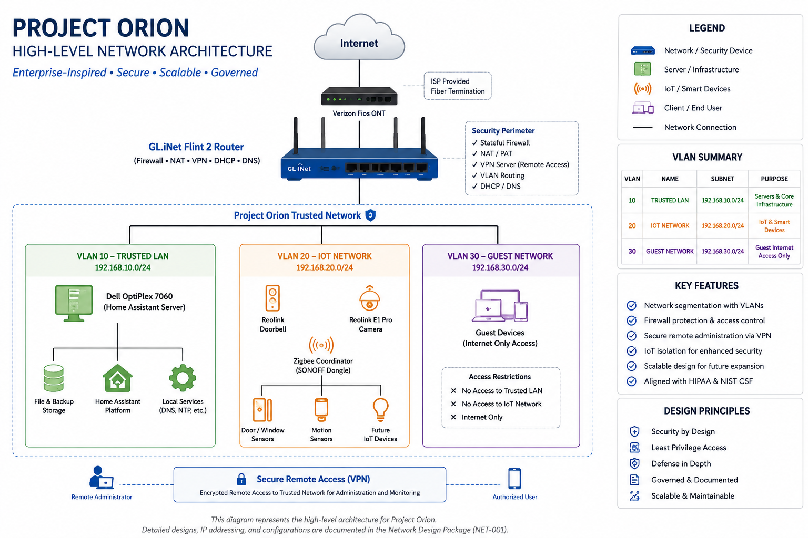

# Project Orion

## Current Release

| Item | Status |
|------|--------|
| **Current Version** | **v1.0** |
| **Release Name** | **Network Design Package** |
| **Status** | 🟢 Released |
| **Sprint** | Sprint 2 Complete |
| **GitHub Release** | [Network Design Package v1.0](https://github.com/GeoJordan/project-orion/releases/latest) |

---

> **Enterprise Infrastructure Engineering Project**

> **Building a secure, governed, enterprise-grade infrastructure from the ground up—one engineering sprint at a time.**
>
> Project Orion is an end-to-end infrastructure engineering project that demonstrates how a secure, well-governed technology environment can be designed, implemented, documented, and operated for a hypothetical small primary healthcare provider using enterprise engineering and cybersecurity best practices.

---

## Project Status

| Item                   | Status                                      |
| ---------------------- | ------------------------------------------- |
| **Project Status**     | 🟢 Active                                   |
| **Current Phase**      | **Phase 3 – Infrastructure Implementation** |
| **Current Sprint**     | **Sprint 3**                                |
| **Latest Release**     | **Network Design Package v1.0**             |
| **Repository Version** | **1.0**                                     |

---

## Table of Contents

- [Current Release](#-current-release)
- [Project Vision](#project-vision)
- [Engineering Methodology](#engineering-methodology)
- [Objectives](#objectives)
- [Project Status](#project-status)
- [Current Project Phase](#current-project-phase)
- [Technology Stack](#technology-stack)
- [Architecture Overview](#architecture-overview)
- [Repository Structure](#repository-structure)
- [Documentation](#documentation)
- [Roadmap](#roadmap)
- [Current Milestone](#current-milestone)
- [Skills Demonstrated](#skills-demonstrated)
- [Why Project Orion?](#why-project-orion)
- [License](#license)

---

# Project Vision

Unlike traditional home lab projects that begin with hardware installation, Project Orion begins with governance.

The project establishes enterprise project management, document control, configuration management, engineering standards, and cybersecurity governance before deploying any technical infrastructure.

This mirrors how infrastructure projects are executed within regulated industries such as healthcare.

---

## Engineering Methodology

Project Orion follows a governance-first engineering methodology modeled after enterprise infrastructure projects.

Every implementation follows the same lifecycle:

1. Plan
2. Design
3. Review
4. Baseline
5. Implement
6. Validate
7. Operate
8. Improve

Each engineering deliverable undergoes Technical Design Authority (TDA) review before being incorporated into the approved project baseline.

---

# Objectives

Project Orion demonstrates practical experience in:

- Enterprise Project Management
- Infrastructure Architecture
- Network Engineering
- Cybersecurity
- Governance, Risk & Compliance (GRC)
- Systems Administration
- Configuration Management
- Technical Documentation
- Operational Readiness

---

# Current Project Phase

## Phase 1 — Governance Foundation ✅

Completed

Deliverables included:

- Project Management Office (PMO)
- Document Control Standard
- Project Control Center
- Sprint Management
- Engineering Session Logs
- Decision Management
- Configuration Management

---
## Phase 2 — Network Infrastructure ✅

Completed

Major Deliverables

- Network Architecture
- Physical Network Topology
- Logical Network Topology
- IP Addressing Plan
- Network Device Inventory
- Network Naming Standard
- Security Zones & Access Rules
- Implementation & Test Plan

**Release:** Network Design Package v1.0

## Phase 3 — Infrastructure Implementation 🚧

Current Activities

- Configure GL.iNet Flint 2
- Deploy Home Assistant
- Configure network services
- Validate physical infrastructure
- Capture implementation evidence

---

# Technology Stack

| Category           | Technologies                                      |
| ------------------ | ------------------------------------------------- |
| Infrastructure     | GL.iNet Flint 2, Dell OptiPlex 7060, Verizon Fios |
| **Automation**     | Home Assistant                                    |
| Security           | VLANs, Firewall Policies, HIPAA, NIST CSF         |
| Project Management | Git, GitHub, VS Code, Markdown, Mermaid           |

---

## Architecture Overview



---

## Infrastructure

- GL.iNet Flint 2 Router
- Dell OptiPlex 7060 Micro
- Verizon Fios
- Home Assistant

---

## Security

- Network Segmentation
- Firewall Policies
- Secure Remote Access
- HIPAA Security Principles
- NIST Cybersecurity Framework

---

## Project Management

- Markdown
- Git
- GitHub
- Mermaid
- VS Code

---

# Repository Structure

```text
project-orion/

├── archive/
│   └── governance/
├── configs/
├── diagrams/
├── docs/
├──images/
|    └── network/
|          └── high-level-architecture.png
|
├── scripts/
├── templates/
│
├── README.md
├── CHANGELOG.md
├── CONTRIBUTING.md
├── SECURITY.md
└── LICENSE

```

---

## Documentation

The `docs/` directory contains the controlled engineering documentation for Project Orion, including:

- Project Management Office (PMO)
- Engineering Standards
- Network Architecture
- Security Documentation
- Engineering Session Logs
- Configuration Management

---

## Roadmap

✅ Phase 1 — Governance

✅ Phase 2 — Network Design Package

🚧 Phase 3 — Infrastructure Implementation

⬜ Phase 4 — Home Assistant Platform

⬜ Phase 5 — Security Hardening

⬜ Phase 6 — Monitoring & Automation

⬜ Phase 7 — Operational Readiness

---

## Current Milestone

Sprint 3 – Infrastructure Implementation

Current Objectives

- Configure the GL.iNet Flint 2 router
- Deploy Home Assistant
- Configure core network services
- Validate network connectivity
- Capture implementation evidence
- Verify deployment against the Sprint 2 Network Design Package

---

## Skills Demonstrated

- Enterprise Network Architecture
- Infrastructure Engineering
- Systems Administration
- Technical Documentation
- Configuration Management
- Cybersecurity Governance
- Network Security
- Project Management
- Git & GitHub Workflow
- Technical Design Reviews

---

## Why Project Orion?

Project Orion demonstrates more than technical implementation.

It showcases the ability to plan, govern, document, secure, and operate enterprise infrastructure using disciplined engineering and project management practices.

The project follows a lifecycle-based approach similar to those used in healthcare, government, and other regulated industries.

---

## License

This project is licensed under the MIT License.

See the [LICENSE](LICENSE) file for complete details.

---

**Project Orion is an active engineering project.**

Documentation and implementation are updated continuously as each engineering sprint is completed.
