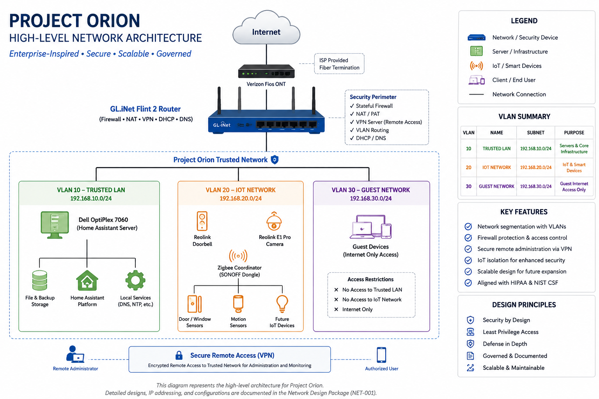

# Project Orion

---


---

## Current Release

| Item | Status |
|------|--------|
| **Current Version** | **v0.7.0** |
| **Release Name** | **Maintenance Management Integration** |
| **Status** | 🟢 Released |
| **Current Sprint** | **Sprint 7.1 Complete** |
| **Latest GitHub Release** | **v0.7.0** |

---

> **Enterprise Infrastructure Engineering Project**

> **Building a secure, governed, enterprise-grade infrastructure from the ground up—one engineering sprint at a time.**
>
> Project Orion is an end-to-end infrastructure engineering project that demonstrates how a secure, well-governed technology environment can be designed, implemented, documented, and operated for a hypothetical small primary healthcare provider using enterprise engineering and cybersecurity best practices.

---

## Project Status

| Item | Status |
|------|--------|
| **Project Status** | 🟢 Active Development |
| **Current Phase** | **Engineering Validation Platform** |
| **Current Sprint** | **Sprint 7.1 Complete** |
| **Latest Release** | **Maintenance Management Integration** |
| **Active Validators** | **5** |

---

## Table of Contents

- [Current Release](#-current-release)
- [Project Vision](#project-vision)
- [Engineering Methodology](#engineering-methodology)
- [Objectives](#objectives)
- [Project Status](#project-status)
- [Current Project Phase](#current-project-phase)
- [Technology Stack](#technology-stack)
- [Architecture Overview](#architecture-overview)
- [Repository Structure](#repository-structure)
- [Documentation](#documentation)
- [Roadmap](#roadmap)
- [Current Milestone](#current-milestone)
- [Skills Demonstrated](#skills-demonstrated)
- [Why Project Orion?](#why-project-orion)
- [License](#license)
- [Architecture Principles](#architecture-principles)
- [Validation Framework](#validation-framework)
- [Engineering Validation Platform](#engineering-validation-platform)
- [Release History](#-release-history)

---

# Project Vision

Unlike traditional home lab projects that begin with hardware installation, Project Orion begins with governance.

The project establishes enterprise project management, document control, configuration management, engineering standards, and cybersecurity governance before deploying any technical infrastructure.

This mirrors how infrastructure projects are executed within regulated industries such as healthcare.

---

## Engineering Methodology

Project Orion follows a governance-first engineering methodology modeled after enterprise infrastructure projects.

Every implementation follows the same lifecycle:

1. Plan
2. Design
3. Review
4. Baseline
5. Implement
6. Validate
7. Operate
8. Improve

Each engineering deliverable undergoes Technical Design Authority (TDA) review before being incorporated into the approved project baseline.

---

## Architecture Principles

Project Orion follows several core engineering principles:

- Governance First
- Security by Design
- Infrastructure as Documentation
- Configuration Before Implementation
- Reusable Validation Framework
- Continuous Validation
- Incremental Engineering

---

# Objectives

Project Orion demonstrates practical experience in:

- Enterprise Project Management
- Infrastructure Architecture
- Network Engineering
- Cybersecurity
- Governance, Risk & Compliance (GRC)
- Systems Administration
- Configuration Management
- Technical Documentation
- Operational Readiness

---

# Current Project Phase

## Phase 1 — Governance Foundation ✅

Completed

Deliverables included:

- Project Management Office (PMO)
- Document Control Standard
- Project Control Center
- Sprint Management
- Engineering Session Logs
- Decision Management
- Configuration Management

---

## Phase 2 — Network Infrastructure ✅

Completed

Major Deliverables

- Network Architecture
- Physical Network Topology
- Logical Network Topology
- IP Addressing Plan
- Network Device Inventory
- Network Naming Standard
- Security Zones & Access Rules
- Implementation & Test Plan

**Release:** Network Design Package v1.0

## Phase 3 — Infrastructure Implementation 🚧

Current Activities

- Configure GL.iNet Flint 2
- Deploy Home Assistant
- Configure network services
- Validate physical infrastructure
- Capture implementation evidence

---

# Technology Stack

| Category       | Technologies                   |
| -------------- | ------------------------------ |
| Languages      | Python                         |
| Data           | Pandas, OpenPyXL               |
| Validation     | JSON Reports                   |
| Development    | VS Code, Git                   |
| Infrastructure | GL.iNet Flint 2, Dell OptiPlex |
| Engineering    | Home Assistant                 |
| Security       | HIPAA, NIST CSF                |

---

## Architecture Overview

<p align="center">
  
</p>

---

## Infrastructure

- GL.iNet Flint 2 Router
- Dell OptiPlex 7060 Micro
- Verizon Fios
- Home Assistant

---

## Security

- Network Segmentation
- Firewall Policies
- Secure Remote Access
- HIPAA Security Principles
- NIST Cybersecurity Framework

---

## Project Management

- Markdown
- Git
- GitHub
- Mermaid
- VS Code

---

# Repository Structure

```text
project-orion/

├── archive/
├── automation/
│   ├── validators/
│   ├── reports/
│   ├── utils/
│   ├── configs/
│   └── run_validation.py
│
├── data/
├── docs/
├── assets/
├── templates/
├── CHANGELOG.md
├── CONTRIBUTING.md
├── SECURITY.md
├── README.md
└── LICENSE

```

---

## Documentation

The `docs/` directory contains the controlled engineering documentation for Project Orion, including:

- Project Management Office (PMO)
- Engineering Standards
- Network Architecture
- Security Documentation
- Engineering Session Logs
- Configuration Management

---

## Roadmap

✅ Phase 1 — Governance

✅ Phase 2 — Network Design Package

🚧 Phase 3 — Infrastructure Implementation

⬜ Phase 4 — Home Assistant Platform

⬜ Phase 5 — Security Hardening

⬜ Phase 6 — Monitoring & Automation

⬜ Phase 7 — Operational Readiness

---

## Validation Platform Roadmap

### Completed

- ✅ Sprint 3 — CMDB Validator
- ✅ Sprint 4 — Asset Register Validator
- ✅ Sprint 5 — IPAM & Firmware Validators
- ✅ Sprint 6 — Shared BaseValidator Framework
- ✅ Sprint 7.1 — Maintenance Schedule Validator

### In Progress

- 🚧 Sprint 7.2 — Change Register Validator

### Planned

- ⬜ Risk Register Validator
- ⬜ Test Register Validator
- ⬜ Engineering Dashboard
- ⬜ Power BI Reporting

---

## Current Milestone

### Sprint 7.2 — Change Register Validator

Current Objectives

- Develop the Change Register Validator
- Validate Change Request IDs
- Validate Change Types and Statuses
- Verify linked CI and Asset references
- Implement CAB approval validation
- Generate standardized JSON validation reports

---

## Skills Demonstrated

- Enterprise Network Architecture
- Infrastructure Engineering
- Systems Administration
- Technical Documentation
- Configuration Management
- Cybersecurity Governance
- Network Security
- Project Management
- Git & GitHub Workflow
- Technical Design Reviews
- Python Automation
- Validation Framework Design
- Data Validation
- JSON Reporting
- Configuration Management Database (CMDB)
- Engineering Data Governance

---

## Why Project Orion?

Project Orion demonstrates more than technical implementation.

It showcases the ability to plan, govern, document, secure, and operate enterprise infrastructure using disciplined engineering and project management practices.

The project follows a lifecycle-based approach similar to those used in healthcare, government, and other regulated industries.

---

## Validation Framework

Project Orion includes a reusable validation framework built around a shared `BaseValidator`.

### Shared Validation Engines

The reusable `BaseValidator` provides common validation services for all engineering workbooks.

| Engine | Purpose |
|--------|---------|
| Duplicate Validation | Detect duplicate identifiers and records |
| Pattern Validation | Validate IDs using regular expressions |
| Allowed Value Validation | Enforce controlled vocabularies |
| Cross-Workbook Reference Validation | Verify relationships between engineering workbooks |

This architecture minimizes duplicated code while ensuring consistent validation behavior across the CMDB, Asset Register, IPAM, Firmware Tracker, and Maintenance Schedule workbooks.

---

## Engineering Validation Platform

Project Orion currently validates five interconnected engineering workbooks through a shared validation framework.

### Active Validators

| Validator | Purpose |
|-----------|---------|
| CMDB | Configuration Item Management |
| Asset Register | Enterprise Asset Tracking |
| IPAM | IP Address Management |
| Firmware Tracker | Firmware Compliance |
| Maintenance Schedule | Preventive Maintenance Management |

Each validator produces standardized JSON reports while sharing reusable validation components from the BaseValidator framework.

---

## License

This project is licensed under the MIT License.

See the [LICENSE](LICENSE) file for complete details.

---

## 📦 Release History

| Version | Date | Highlights |
|---------|------|------------|
| **v0.7.0** | August 2026 | Added Maintenance Schedule Validator, cross-workbook CI & Asset validation, expanded platform to five integrated validators |
| **v0.6.0** | July 2026 | Introduced the shared BaseValidator framework and reusable validation utilities |
| **v0.5.0** | July 2026 | Added Firmware Tracker Validator and engineering validation reports |

---

**Project Orion is an active engineering project.**

Documentation and implementation are updated continuously as each engineering sprint is completed.
