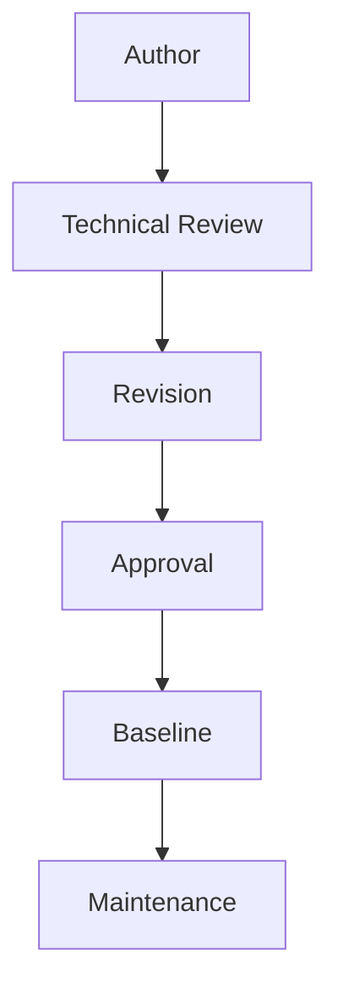

# STD-001 — Document Control Standard

---

## Document Mission

The Document Control Standard establishes the governance framework for creating, reviewing, approving, versioning, baselining, revising, and maintaining all controlled documents within Project Orion. It defines the mandatory document management practices that ensure consistency, traceability, quality, and lifecycle management across the project repository.

This standard serves as the governing authority for all project documentation and shall be followed by every controlled document produced throughout the Project Orion lifecycle.

---

## Document Control

| Field | Value |
|--------|-------|
| **Document ID** | STD-001 |
| **Document Title** | Document Control Standard |
| **Project** | Project Orion |
| **Project Baseline** | Baseline 1.0 |
| **Owner** | George Jordan |
| **Technical Advisor** | ChatGPT |
| **Document Version** | 1.0 |
| **Status** | Baselined |
| **Classification** | Internal |
| **Created** | 2026-06-29 |
| **Last Updated** | 2026-07-08 |

---

## Revision History

| Version | Date       | Author        | Reviewer                  | Description                               |
| ------- | ---------- | ------------- | ------------------------- | ----------------------------------------- |
| **1.0** | 2026-07-10 | George Jordan | Project Technical Advisor | Governance Package Version 1.0 baselined. |

---

## 1. Purpose

This standard establishes the document control process for Project Orion. It defines how project documents are created, versioned, reviewed, approved, baselined, revised, archived, and maintained throughout the project lifecycle.

The objective is to ensure that every controlled document remains accurate, traceable, consistent, and easy to manage while supporting engineering, cybersecurity, and governance best practices.

---
## 2. Scope

This standard applies to all controlled documents contained within the Project Orion repository, including project management documents, technical documentation, engineering guides, architecture diagrams, configuration guides, standards, procedures, and supporting references.

---

## 3. Controlled Documents

| Document Type | Controlled |
| PM Documents | ✅ |
| Standards | ✅ |
| Architecture Guides | ✅ |
| Configuration Guides | ✅ |
| Test Reports | ✅ |
| Phase Reports | ✅ |
| Asset Registers | ✅ |
| Risk Registers | ✅ |
| Decision Logs | ✅ |

---

## 4. Document Identification

| Prefix | Meaning |
|--------- | ------------|
| PM | Project Management |
| STD | Standard |
| ARCH | Architecture |
| NET | Network | 
| HW | Hardware |
| SEC | Security |
| GRC |Governance, Risk & Compliance |
| OPS | Operations |
| DR | Disaster Recovery |

---

## 5. Document Status Lifecycle

| Status | Meaning |
| ------- | ------- |
| Draft | Initial development |
| Under Review | Awaiting technical review |
| Approved | Content accepted |
| Baselined | Official controlled version | 
| Revised | Updated after baseline |
| Archived | No longer active |

---

## 6. Version Numbering

| Version | Meaning |
| ------- | ------- |
| 0.1–0.9 | Draft development |
| 1.0 | Initial baseline |
| 1.x | Minor revisions |
| 2.0 | Major revision |

---

## 7. Review & Approval Process

---

## 8. Document Ownership

| Role | Assigned To |
| ---- | ----------- |
| Document Owner | George Jordan |
| Technical Advisor | Project Technical Advisor |
| Approval Authority | George Jordan |

---

## 9. Repository Governance

The following governance principles apply to the Project Orion repository:

- Git provides repository version control.
- Every controlled document maintains its own Revision History.
- Approved and baselined changes shall be committed to Git following completion of the applicable governance review.
- Superseded documents shall be archived rather than deleted.

---

## 10. References

- PM-001 Project Control Center
- PM-002 Project Roadmap
- PM-003 Sprint Status Tracker
- PM-004 Risk Register
- PM-005 Decision Log
- PM-006 Engineering Session Log

